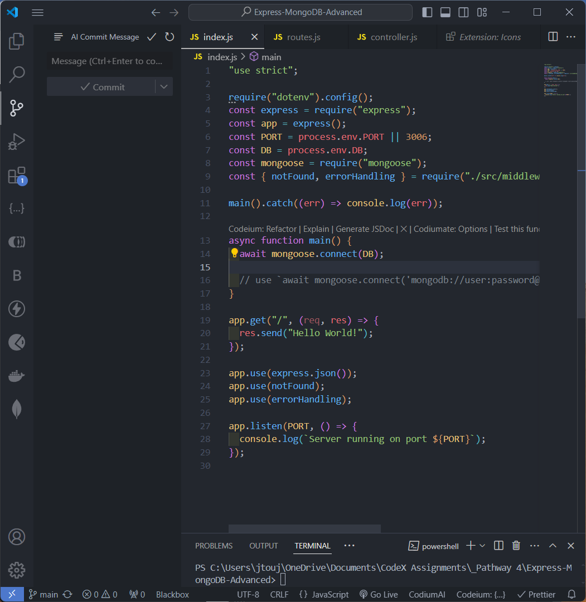
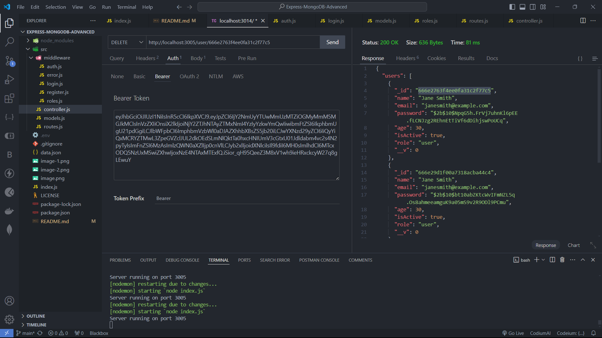
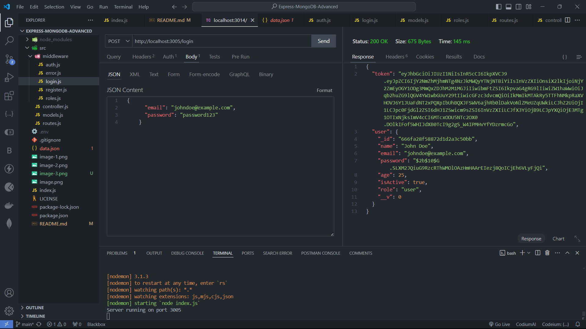

# Express-MongoDB-Advanced

CRUD application using MongoDB and ExpressJS.

## Creating a CRUD application



Here is the image fof the initial index.js file for my CRUD application.


This is the image of the application sucessfully working initially.

## Manpultng the database

With the token I am able to delete user info from the database.



Here is the code that I used to delete the user:

```js
async function deleteUser(req, res, next) {
  try {
    const { id } = req.params;
    await User.findByIdAndDelete(id);
    res.status(200).json({ message: "User deleted successfully." });
  } catch (error) {
    res.status(500).json({ message: error.message });
  }
}
```

To update the user in my controller I got the information to change when on save.

```js
async function updateUser(req, res, next) {
  try {
    const { id } = req.params;
    const { name, age, isActive } = req.body;
    const user = await User.findById(id);
    user.name = name;
    user.age = age;
    user.isActive = isActive;
    await user.save();
    res.status(201).json({ message: "User updated successfully." });
  } catch (error) {
    res.status(500).json({ message: error.message });
  }
}
```

## Login and Register

I have used the JWT token to login and register.



When I registered a new user it adds it to my database. When login it shows the token and the user information.

## Authorization

I have used the JWT token to authorize the user.

```js
function auth(req, res, next) {
  const token = req.header("Authorization").replace("Bearer ", "");
  if (!token) {
    return res.status(401).send({ error: "Please authenticate." });
  }
  try {
    const decoded = jwt.verify(token, process.env.SECRET);
    req.user = decoded;
    next();
  } catch (error) {
    next(error);
  }
}
```

To get authorization for the user I created a token and to secure the password I used bcrypt to hash the password.
